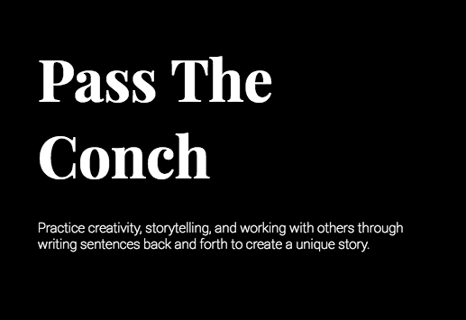
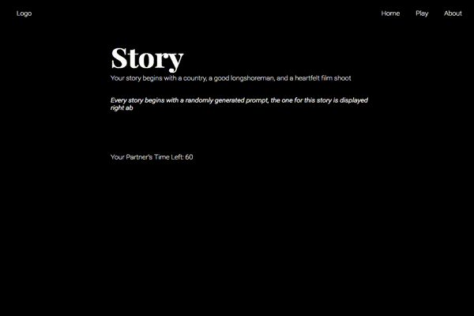
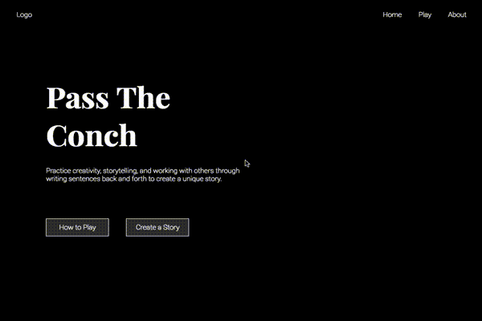

# Pass The Conch

[Heroku link][heroku] **NB:** Snapshots Live Link!

[heroku]: https://passtheconch.herokuapp.com/

Pass the Conch was created as a short, turn-based game to help people practice creative writing and joint storytelling. It is meant as a way to warm up before writing, to postpone boredom, or however else you would like to use it. None of the stories are saved, so if you like what you write, make sure to copy & paste it to another application before starting your next story. Otherwise, it will be gone forever!

## Features & Implementation

### How to play

Pass the Conch teaches you how-to-play the best way, by actually playing it! The user is put into a game experience so similar to what they would be experiencing, that it utilizes the same react components that are rendered when playing the real game. Of course when learning how to play, one shouldn't be messing up other user's experiences, so fake states are passed into the components that through timeouts (to simulate the other player's input) and fake actions preformed by the user. I gave the pretend player a dialogue to preform with how-to-play text about what's it like to be an AI, hoping it would be entertaining and give more character to Pass The Conch.

### Play the game!

Pass the Conch uses web sockets to allow one user to communicate to another in real time. The clients connect through the server as opposed of client-to-client allowing for validations of client actions, and a possibility to easily expand for more features and validations at the trade off of an increase on the server load. Currently games are given a randomly generated prompt, have a 10 sentence limit, 60 seconds to come up with, and type, the next sentence of the story, and 100 characters of which to do so.

### Design

Pass the Conch is an extremely simple and focused product, and as such, it's design is created to reflect that purpose. All the other elements on the page serve a particular single purpose and fulfill that purpose when interacted with. Everything also has a very simple transition which clearly conveys to the user that it has received action and is processing their request.  And yes, while the white text on a black background is bold and pretentious, it's also very functional. This is a text based game and if one was to play for a significant amount of time, their eyes would be thankful that it's not the other way around.

## Future Directions for the Project
Features to add to the project when I have more time.

### AI
Nobody else online? Why not play with an AI! I think it would be a fun/interesting feature to develop as well. Also if it's crazy enough, people might just want to play with it for fun as it could give interesting results. Also could be implemented with the how to play to make the how to play more realistic.

### Different Game Types
Make it so users can choose the limit of sentences, the time one has to submit their next sentence, and the limit to the number of characters. Have three choices for each one, so that people have more control over which type of story they want to write. Also generate different themed prompts, or different genre of stories so that people who would like to joint write more mysteries, fiction, or other types can write that with like minded people. Also a way to increase the number of people who can contribute to one story, why limit it to two people, why not allow up to 10 or something.

### Make an actual backend/product
Roll out a backend with a db, so that users can login and save stories, have friends, and the ability to create games with only their friends. Also would allow for people to browse popular stories that people have written and ultimately become more of a platform for joint creative story telling.

####Side note about file structure
For practice of thinking about and developing micro services, I made two different servers. One to serve the client the html, css, and javascript, and one to handle all the web sockets connections and communications. This doesn't really make sense for the current application and it currently isn't deployed as such, but it was fun practice to think about and develop around.
